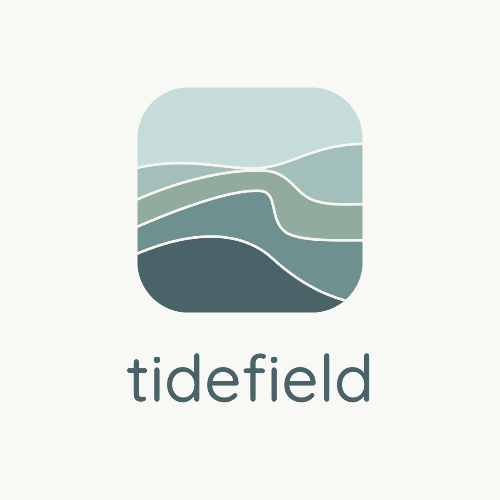

# Tidefield user manual



Tidefield is an instrument for playing ambient music live. There are no tracks to
arrange. A handful of sound sources run all the time, drifting on their own, and you
steer the whole of them at once: where the sound sits on a map called the terrain, how
fast everything moves, which key it settles into, and the gestures you play over the
top. A performance can last five minutes or three hours.

This manual covers version 1.3 on macOS, as a standalone app and as an Audio Unit or
VST3 plugin.

## Contents

1. [Installing](#1-installing)
2. [A first session](#2-a-first-session)
3. [The window](#3-the-window)
4. [The terrain and scenes](#4-the-terrain-and-scenes)
5. [Time, key and tempo](#5-time-key-and-tempo)
6. [The pads](#6-the-pads)
7. [Sound sources](#7-sound-sources)
8. [Recorded on: the Medium](#8-recorded-on-the-medium)
9. [Seasons](#9-seasons)
10. [Modulation](#10-modulation)
11. [Mixer and effects](#11-mixer-and-effects)
12. [Master, auto master and safety](#12-master-auto-master-and-safety)
13. [Space: speakers and headphones](#13-space-speakers-and-headphones)
14. [Takes](#14-takes)
15. [The timeline](#15-the-timeline)
16. [Recording to disk](#16-recording-to-disk)
17. [Sessions, sounds and presets](#17-sessions-sounds-and-presets)
18. [MIDI and remote control](#18-midi-and-remote-control)
19. [Installation mode](#19-installation-mode)
20. [The projector](#20-the-projector)
21. [Settings and appearance](#21-settings-and-appearance)
22. [Tidefield in a DAW](#22-tidefield-in-a-daw)
23. [Keyboard reference](#23-keyboard-reference)
24. [Troubleshooting](#24-troubleshooting)

---

## 1. Installing

Tidefield runs on a Mac with Apple Silicon and macOS 12 or later, or on a 64-bit PC
with Windows 10 or 11 (see [On Windows](#on-windows) below).

### On macOS

**The app.** Download `Tidefield-macOS-arm64.zip` from the latest release, unzip it
and drag `Tidefield.app` into Applications. The app is not notarised by Apple, so the
first time you open it, right-click it, choose Open, then Open again. If macOS still
refuses, run this once in Terminal:

```
xattr -cr /Applications/Tidefield.app
```

Allow microphone access when asked if you want to play an instrument or voice through
the live input. Then click **Settings** in the top right (or press Cmd+,), open **Audio** and choose your
audio interface, sample rate and buffer size. A buffer of 256 samples is a good start.

**The plugins.** `Tidefield-Plugins-macOS-arm64.zip` holds an Audio Unit and a VST3.
Copy `Tidefield.component` to `~/Library/Audio/Plug-Ins/Components` and
`Tidefield.vst3` to `~/Library/Audio/Plug-Ins/VST3`, then rescan plugins in your DAW.
Tidefield appears as an instrument. See [Tidefield in a DAW](#22-tidefield-in-a-daw).

### On Windows

**The app.** Download `Tidefield-Windows-x64.zip` from the latest release and unzip it
anywhere you like (your Documents folder, or `C:\Program Files` if you have
administrator rights). Open the `Tidefield` folder and run `Tidefield.exe`. Nothing else
needs installing. The app is not code-signed, so the first time Windows SmartScreen
may show "Windows protected your PC": click **More info**, then **Run anyway**. If
Windows marked the zip as downloaded from the internet and blocks the app, right-click
the zip, choose Properties, tick **Unblock** and unzip it again.

Click **Settings** in the top right (or press Ctrl+,), open **Audio** and choose your
audio interface. Windows Audio (WASAPI) works with every device; start with a buffer of
256 or 512 samples. Wherever this manual writes Cmd, use Ctrl on Windows (Ctrl+S saves,
Ctrl+Z undoes); there is no menu bar, everything is in the window. To open a `.tide`
project, use the session menu's Open, or drag the file onto `Tidefield.exe`.

**The plugin.** `Tidefield-Plugins-Windows-x64.zip` holds a VST3 (Windows has no Audio
Units). Copy the whole `Tidefield.vst3` folder to `C:\Program Files\Common Files\VST3`
(Windows asks for administrator permission), then rescan plugins in your DAW.
Tidefield appears as an instrument, as on macOS.

---

## 2. A first session

When Tidefield opens, a starter session is already laid out: six scenes named Still,
Dawn, Glass rain, Tidepool, Deep water and Storm, with a choir, a singing bowl and
glass loaded into the sampler sources. Everything is silent until you fade in.

1. Press **Space**. The whole instrument fades in over eight seconds.
2. Drag across the dark terrain in the middle of the window. The sound glides after
   your cursor, and each scene's marker fills as it takes over.
3. Press **1** to **6** to travel to a scene, or click its marker.
4. Raise **Wander** on the right. The sound starts to roam by itself near your cursor.
5. Hold **S** for a few seconds and let go. That is Swell: everything blooms, then ebbs
   back.
6. Press **M** and play the letter keys like a piano. Press **M** again to leave.
7. Press **K**. The last twenty seconds you heard become a new granular cloud that keeps
   playing.
8. When you have found something you like, double-click an empty part of the terrain
   to keep it there as a new scene.
9. Press **Space** to fade out, and **Cmd+S** to save the session.

Hover over anything and the status bar at the bottom says what it does.

---

## 3. The window

| Area | What is there |
|---|---|
| Top bar | the session menu, Fade, Panic, Rec, Auto master, Keys, tempo, CPU load, output meter and Audio |
| Browser (left) | scenes, Capture, the factory sounds and your own sounds |
| Terrain (centre) | the map you play on |
| Performance (right) | Tide, Wander, Gravity, Glide, key, scale, wander style and the Medium |
| Pads (under the terrain) | the gestures, the Shape pad and the take recorder |
| Device tabs (bottom) | every source, modulation, the timeline, the mixer, effects, master and MIDI |
| Status bar | help for whatever is under the mouse, and messages |

**Controls.** Drag knobs and faders up and down; hold Shift for fine moves.
Double-click a control to reset it. Right-click any control for its menu:

- **MIDI learn**: the next knob you move on a controller takes over this control.
- **Forget MIDI mapping**: removes that mapping.
- **Release to the terrain**: hands a held control back (see
  [the live layer](#the-live-layer)).
- **Reset to default**.
- **Modulate with**: lets an LFO, a follower or your controller move this control (see
  [Modulation](#10-modulation)).

**Undo.** Cmd+Z undoes and Shift+Cmd+Z redoes. The session menu shows what will be
undone. Control changes (one step per drag), scene captures, moves, renames and
deletions, modulation routes, seasons, effect choices and timeline edits can all be
undone. Performance moves (the terrain cursor, held gestures and the Shape pad) are
left out on purpose, so undo never yanks the sound around mid-performance. Opening or
starting a session clears the history.

**Colours carry meaning.** The theme's highlight colour marks values and selections.
Yellow means a control is held in the live layer. Pink means MIDI learn, and a small
pink arrow beside a knob means your controller has not caught up with it yet: turn the
controller in the direction of the arrow until it picks up.

**The top bar.**

- **Session name**: New, Open, Save, Save as, the projector window, Settings and Appearance.
- **Fade in / Fade out**: the same as Space.
- **Panic**: silence now. See [Safety](#safety).
- **Rec**: record to disk. Right-click for stems and the recordings folder.
- **Auto master**: see [Auto master](#auto-master).
- **Keys**: play Bloom from the computer keyboard (the same as M).
- **Sync, tempo and Tap**: see [Tempo sync](#tempo-sync).
- **CPU**: the audio load. "lite 1" to "lite 5" means Tidefield is lightening its own
  load to stay glitch-free (see [Troubleshooting](#24-troubleshooting)).
- **Settings**: every preference, in tabs (see [Settings](#21-settings-and-appearance)).

---

## 4. The terrain and scenes

### Scenes

A **scene** is a snapshot of how the instrument sounds, pinned to a place on the
terrain. Where your cursor sits decides the sound: close to one scene you hear that
scene, between several you hear a blend of them. Scenes store only the controls that
shape sound, never the master level or the fade.

| To | Do this |
|---|---|
| Travel to a scene | click its marker, click it in the Browser, or press its number (1 to 9) |
| Arrive at once instead of gliding | Shift-click it, or Shift+number |
| Move a scene | drag its marker |
| Keep what you hear as a new scene | double-click an empty spot, or press C to place it at the cursor |
| Rename, update or delete | right-click the marker or its row in the Browser |

A terrain holds up to 32 scenes. The scene menu has:

- **Glide here**.
- **Rename**.
- **Update with what you hear now**: overwrites the scene with the current sound.
- **Fold held controls into this scene**: writes only the controls you are holding in
  the live layer into the scene, and leaves the rest of it alone.
- **Delete**.

### Moving around

| Control | Range | What it does |
|---|---|---|
| Glide | 50 ms to 30 s | how long the sound takes to arrive where you point |
| Focus (Gestures tab) | 1 to 6 | high: each scene is a distinct place; low: everything blends |
| Wander | 0 to 100% | how far the sound strays from your cursor on its own |
| Wander Rate (Gestures tab) | | how fast it strays |

The arrow keys nudge the cursor (Shift for small steps).

### Wander styles

Under Wander on the right:

- **Drift**: a slow random walk around your cursor.
- **Orbit**: circles around the cursor.
- **Tide pool**: drifts but is pulled towards the nearest scene, so it settles into
  places.
- **Journey**: travels from scene to scene on its own.
- **Path**: follows a loop you draw. Press **Draw path** above the terrain (or **P**),
  then draw a loop with the mouse. The sound travels it; Wander sets how closely and
  Wander Rate how fast. Press P again or Escape to stop drawing.

### The live layer

When you touch a control, it stops following the terrain and stays where you put it.
It turns yellow to show it is held. Moving across the terrain then changes everything
else, but not that control.

Press **R** to hand every held control back to the terrain, or right-click one control
and choose **Release to the terrain**. To make a held setting part of a scene, use
**Fold held controls into this scene** from the scene's menu.

---

## 5. Time, key and tempo

### Tide

**Tide** (0.05x to 8x) is the speed of everything that moves by itself: drift, wander,
rain, the grain scan, the cycles and the seasons. At 0.25x the whole piece breathes
four times slower. Pitch and delay times never change with Tide.

### Key, scale and Gravity

Every pitched source plays in the key and scale chosen on the right.

- **Scales**: Major, Minor, Dorian, Lydian, Mixolydian, Major pentatonic, Minor
  pentatonic, Whole tone, Hirajoshi, In sen, Fifths and Chromatic.
- **Gravity** (0 to 100%) is how strongly every source is pulled into the key. At 100%
  everything snaps to scale notes; lower, notes lean towards them and keep some of their
  own pitch. Several sources also have their own Gravity control, which scales this one
  for that source alone.
- **Changing key.** A key change is never a jump. Each voice moves to the new key at
  its own moment over the **Key Morph** time (0.5 to 60 s, Gestures tab), so the harmony
  turns over gradually.

### Tempo sync

Tidefield is free-time by default. Turn on **Sync** in the top bar and:

- the Cycles lock to whole beats;
- the Tape Delay and Worn Echo snap their times to note lengths.

Drag the tempo number to change it (40 to 200 BPM), or click **Tap** in time. The dot
beside Sync blinks on the beat. In a DAW, Sync follows the project's tempo and position
and the number turns the tide colour.

---

## 6. The pads

The row under the terrain holds the gestures. Each pad shows its key in the corner, its
state underneath and its level as a line of water rising from the bottom.

| Pad | Key | What it does |
|---|---|---|
| Swell | hold S | every send blooms, filters open and the clouds thicken; on release it ebbs back |
| Hush | hold H | every source sinks while the reverb and delay keep ringing |
| Slow | hold T | time slows to a quarter, then eases back when you let go |
| Shape | drag | left darkens, right brightens; up pushes the sound far into the reverb, down pulls it close and dry. Double-click to recentre |
| Freeze all | F | holds the last two seconds as a cloud while the rest of the mix steps back |
| Hold input | I | freezes the live input's sound into an endless spectral pad |
| Loop | L | the tape looper: record, close the loop, overdub (Shift+L clears) |
| Cycles | E | long note loops that never line up |
| Take | G | records your moves and plays them back (see [Takes](#14-takes)) |
| Catch | K | turns the last few seconds into a cloud |

Swell's depth, rise and ebb times, Hush's depth and Freeze's settings live on the
**Gestures** tab.

---

## 7. Sound sources

Each tab along the bottom opens a source. Most tabs end with that source's **strip**:
level, pan, width, reverb and delay sends, and **Effects** for its two insert slots.
A level or send turned all the way down reads Off and is silent.

### Drone

The heart of most pieces: a stack of up to six slowly drifting voices built on one
root note. Its controls are in three groups on the Drone tab.

**Drone**

| Control | Range | What it does |
|---|---|---|
| Wave | Classic, Pulse, Fold, Organ, FM | the oscillator each voice uses |
| Chord | Open, Fifths, Octaves, Minor, Major, Suspended, Cluster, Harmonics | which notes the voices stack and wander between; changing it revoices smoothly |
| Root Note | C1 to C5 | the lowest note; the voices stack on it in the key |
| Density | 1 to 6 | how many voices sound at once |
| Shape | 0 to 100% | depends on the wave (see below) |
| FM Ratio | 0.5x to 8x | FM only: the modulator's pitch against the voice; whole numbers sound harmonic, others like bells |
| Detune | 0 to 50 cents | how far each voice's three oscillators spread from true pitch |
| Sub | 0 to 100% | a pure sine an octave below the root |

What Shape does for each wave:

| Wave | Left | Right |
|---|---|---|
| Classic | bright saw | pure sine |
| Pulse | square | thin, nasal pulse |
| Fold | soft sine | sine folded over on itself, rich and hollow |
| Organ | dark, few drawbars | bright, many drawbars |
| FM | pure sine | strong modulation, metallic |

**Tone**

| Control | What it does |
|---|---|
| Filter | Low-pass, Band-pass or High-pass |
| Brightness | the filter frequency, 60 Hz to 12 kHz |
| Resonance | the filter's peak |
| Key Track | lets higher voices open the filter further |
| Tilt | quietens the higher voices so the low notes lead |
| Drive | saturation, matched in level so only the colour changes |
| Breath, Breath Tone | air under the tone, and how dark or bright it is |

**Motion**

| Control | What it does |
|---|---|
| Evolve | how often voices move to new notes of the chord |
| Revoice Time | how long a voice takes to fade to its new note, 0.5 to 30 s |
| Glide | how long the voices take to follow a new root, 0.05 to 30 s |
| Drift Depth, Drift Rate | how far and how fast each voice wanders in pitch, tone, level and position |
| Vibrato, Vibrato Rate | pitch wobble on every voice |
| Tremolo, Tremolo Rate | a swell in level, from slow breathing to a fast flutter |
| Spread | stereo width of the voices |
| Gravity | this source's pull into the key |

The drone has fifteen factory presets in the Presets menu on its title bar, from Low
hum and Tanpura field to Glass FM bells, Sub cathedral and Distorted engine. Loading a
preset sets every drone control, so it sounds the same whatever was set before.

### Clouds

Four granular clouds, each playing a sound in tiny overlapping grains. Load a sound by
clicking the waveform, by dropping one from the Browser, or with Catch. Right-click the
waveform to clear it. The dots on the waveform are the grains playing right now, and
the line is where the cloud is reading.

| Control | Range | What it does |
|---|---|---|
| Density | 0.5 to 200 grains a second | how thick the cloud is |
| Grain Size | 10 ms to 2 s | short grains sparkle, long grains smear |
| Position | 0 to 100% | where in the sound the grains come from |
| Spray | 0 to 100% | how far grains scatter around Position |
| Scan | -100 to +100% | moves Position by itself, backwards or forwards, at Tide speed |
| Pitch | -24 to +24 semitones | |
| Detune | 0 to 100% | random pitch spread between grains |
| Harmonize | 0 to 100% | some grains play at other notes of the chord |
| Reverse | 0 to 100% | the share of grains played backwards |
| Envelope | 0 to 100% | the shape of each grain: percussive at 0, soft at 50%, flat and full at 100% |
| Stereo | 0 to 100% | how widely grains spread across the field |
| Gravity | 0 to 100% | pulls grain pitches into the key |

### Resonator

A bank of tuned resonators, like strings or bells, that ring when something strikes
them.

| Control | What it does |
|---|---|
| Root Note, Modes | the lowest note and how many resonances (1 to 24) |
| Structure | from strings on the left to bars and bells on the right |
| Decay | how long each mode rings, 0.1 to 60 s |
| Brightness, Spread, Gravity | tone, stereo width and pull into the key (bells at the far right of Structure keep their own tuning) |
| Rain, Rain Colour | random strikes like drops on a resonant surface, and their tone |
| Excite from: Input, Drone, Clouds, Bloom | lets other sources strike the resonators |

### Bloom

A keyboard sampler that turns ordinary one-shots (a pluck, a glass tap, a word) into
ambient material. Load a sound with the waveform, then play it from the keyboard on the
tab, the computer keyboard (M), a MIDI keyboard or the Cycles.

Each note goes through a **Transform**:

| Transform | Result |
|---|---|
| Swell | the tail reversed rising into the attack, then stretched into a pad |
| Smear | a long granular stretch with the pitch held |
| Freeze | one moment (set by Position) held forever with a slow shimmer |
| Ghost | the attack removed; only a resonant tail, tuned to the key |
| Constellation | the note scattered as a chord from the scale, arriving at random |
| Tape | varispeed playback through its own worn medium |

**Several sounds across the keyboard.** One sound stretched far from the note it was
recorded at can sound thin. Bloom can hold up to eight sounds, each with its own root
note, and plays every note from the sound whose root is nearest. Choose several files
at once when loading into Bloom, or use **Add to Bloom's keyboard** in the Browser.
The keyboard on the Bloom tab marks each sound's root.

**Automatic tuning.** When you load your own sound into Bloom, Tidefield listens for
its pitch and sets Sample Root to match, and the status bar names the note it found.
Noisy or unpitched sounds are left alone.

**MPE and pitch bend.** Pitch bend bends every Bloom note. With **MPE keyboard** on (on
the MIDI tab), each note bends, presses and brightens on its own.

Other controls: **Amount** (how strongly the transform acts), **Length**, **Attack**
(Swell rises out of the sample by itself, and Ghost always fades in over at least
1.5 s), **Release**, **Pitch**, **Tone** (follows notes that are already sounding),
**Spread**, **Random** (variation between repeated notes so they never sound
identical), **Position** (the moment Freeze and Ghost take), **Gravity** and **Sample
Root** (the note the sound was recorded at, so it plays in tune).

### Input

The live input from your audio interface: a microphone, guitar or synth.

- **Monitor**: lets you hear the input through its strip. It is off until you turn it
  on, so there is no surprise feedback.
- **Channel**: Input 1, Input 2 or both.
- **Input Gain**, **Low Cut** and **Gate**.
- **Hold** (or I, or the Hold input pad): freezes whatever the input is playing into an
  endless pad. **Freeze Level** sets its volume and **Freeze Drift** how much it moves.
- **Catch** settings live here:
  - **Catch Source**: the output or the live input.
  - **Catch Into**: Auto picks a cloud for you, or name one.
  - **Catch Length**: 5 to 30 s.
  - **Catch now**: does the same as K.

### Looper

A tape loop that wears out, in the manner of William Basinski's Disintegration Loops.

1. Press **Record** (or L) to start.
2. Press it again to close the loop. It then plays on its own.
3. Press again to overdub, and again to stop overdubbing.
4. Shift+L fades the loop out and clears it.

| Control | What it does |
|---|---|
| Source | records the live input or the whole mix |
| Erosion | how much each pass wears the tape |
| Flakes | dropouts, like oxide falling off old tape (they come with Erosion; at 0 Erosion the tape stays whole) |
| Overdub | how much of the old loop survives each overdub |

### Weather

Procedural wind, rain and surf. **Wind**, **Rain** and **Surf** set each layer.
**Gusts** sets how much they swell and lull, **Tone** sets the brightness, and
**Distance** runs from right here to far across a valley.

### Cycles

Several sparse note loops of different lengths that never line up, after Brian Eno's
*Music for Airports*. The notes come from the key, so they always agree. Turn them on
with **E** or the Cycles pad.

| Control | What it does |
|---|---|
| Play Into | Bloom, the Resonator or both |
| Voices | how many loops, 1 to 8 |
| Pattern | which set of cycle lengths and notes; try a few |
| Pace | the speed of every loop together, 0.25x to 4x |
| Density | how many of each loop's notes actually play |
| Register, Spread | the centre note and how many octaves the notes cover |
| Velocity | how hard the notes are played |

The **Tempo** device on the same tab holds Tempo Sync and the tempo itself.

---

## 8. Recorded on: the Medium

**Recorded on**, at the bottom of the Performance panel, makes everything sound as if it
had been printed to a medium. It sits on the master, so you hear it live and it is in
your recordings.

| Type | Sound |
|---|---|
| Digital | clean |
| Cassette | hiss, wow and flutter, a soft low boost, highs that fade with age, gentle saturation, the odd dropout |
| Vinyl | crackle and pops, surface noise and rumble, slow wow, mono lows |
| Sampler | 12-bit grit, a lower sample rate, input drive and a warm filter |

On the Gestures tab: **Age** (how worn), **Noise**, **Wobble**, **Drive** and
**Medium Mix**. Switching type crossfades smoothly, so you can change it mid-piece.

---

## 9. Seasons

A season moves one control slowly back and forth for as long as you play: a filter that
opens over ten minutes, a reverb send that rises and falls once an hour.

1. Open the **Seasons** tab and click **Add a season**.
2. Choose the control it should move.
3. Click the season in the list to set its depth, its length (20 seconds to an hour)
   and its shape (Sine, Triangle or Drift).

The dot in each row shows where the cycle is now. Up to eight seasons can run at once.
**Seasons** under All seasons scales every season together, so you can fade the whole
of that slow movement in or out. Seasons follow Tide.

---

## 10. Modulation

Modulation lets one thing move another while you play: a slow LFO breathing the reverb
send, the loudness of your voice opening the drone's filter, the mod wheel bending
Bloom's pitch.

**Making a route.** Right-click any knob and choose **Modulate with**, then a source.
Or open the **Modulation** tab and click **Add a route**, choose a source, then the
control it should move. Each route has a **Depth** knob: right of centre pushes the
control up, left of centre pushes it down. A moving arc around a modulated knob shows
where the modulation has taken it. Click the x on a row to remove a route. Up to 16
routes can run at once, and they are saved with the session.

| Source | What it follows |
|---|---|
| LFO 1 to 4 | a steady cycle; **Rate** from one cycle every 200 s to 20 per second, **Shape** Sine, Triangle, Ramp, Square or Steps |
| Random 1 and 2 | a new random value at **Rate**; **Smooth** glides between them |
| Input level, Input brightness | how loud and how bright the live input is |
| Mix level | how loud everything you hear is |
| Velocity, Note pitch | the last note played on Bloom |
| Mod wheel, Pressure | from a MIDI keyboard |
| Terrain X, Terrain Y | where the sound is on the terrain |

The followers on the Modulation tab share **Attack**, **Release** and **Gain**, which
set how quickly they react and how strongly. The meters on the tab show every source
moving. Modulation adds to where a control is; it never changes the value you set, so
removing a route returns the control exactly.

---

## 11. Mixer and effects

### Mixer

The **Mixer** tab shows every source's strip side by side, plus the reverb and delay
**Returns**. Each source has:

- a level fader with a meter;
- pan;
- width (0 is mono, 100% as recorded, 200% wider);
- a send to the reverb bus and a send to the delay bus.

### Effects

There are 28 effect slots:

- two on every source;
- two on the reverb bus;
- two on the delay bus;
- two on the master.

Open the **Effects** tab, pick a chain on the left, then choose an effect type in each
slot. Every slot has six controls and a **Mix**.

| Effect | Controls |
|---|---|
| Cloud Reverb | Size, Decay, Damping, Pre-delay, Modulation, Hold (holds the tail forever) |
| Tape Delay | Time, Feedback, Tone, Spread, Wobble, Age |
| Worn Echo | Time, Feedback, Medium, Age, Wobble, Spread (a delay that degrades with every repeat) |
| Ensemble | Rate, Depth, Vibrato, Voices, Spread, Tone |
| Spectral Blur | Blur, Smear, Drift, Shimmer, Tone, Freeze |
| Sympathetic Strings | Excite, Decay, Brightness, Register, Strings, Level (strings tuned to the key that ring along with the sound) |
| Medium | Type, Age, Noise, Wobble, Drive |
| Filter | Mode (low, band, high, notch), Cutoff, Resonance, Drive, Sweep, Rate (Sweep moves the cutoff with a slow LFO) |
| Pitch Shimmer | Interval, Shimmer, Tone, Size, Detune, Low Cut (pitch-shifted repeats that climb with Shimmer) |
| Phaser | Rate, Depth, Feedback, Stages, Centre, Stereo |
| Tremolo | Rate, Depth, Shape, Stereo, Smooth, Wander (Stereo at 100% is an auto-pan) |
| Saturator | Drive, Bias, Tone, Warmth, Compensate, Output (Compensate keeps the level steady as Drive rises) |
| Grain Delay | Time, Size, Density, Pitch, Feedback, Jitter (grains read from a delay, scattered in time and pitch) |
| Glue Compressor | Threshold, Ratio, Attack, Release, Makeup, SC High-pass |
| Lo-fi | Bits, Rate, Noise, Wow, Filter, Drive |

The reverb bus starts with Cloud Reverb and the delay bus with Tape Delay. Effects can
be changed while playing; the change crossfades.

### Your own plugins

In the standalone app any effect slot can also hold an Audio Unit or VST3 effect
installed on your Mac. Open the effect type menu in a slot and choose **Find my
plugins...** the first time. Tidefield looks through your plugins in the background;
if one crashes while being examined, it is skipped from then on. The plugins appear
under **Plugins**, grouped by maker.

When a plugin is loaded, the slot's six knobs take over its first six automatable
controls, showing the plugin's own values, so they can be MIDI learned, modulated and
recorded like any other knob. **Choose controls** lists every parameter the plugin
offers and points any knob at any of them; the choice is saved with the session. **Open** shows the plugin's own window, and changes made
there move the knobs too. The plugin's full state is saved with the session. If a
session names a plugin this Mac does not have, the slot opens empty and the status bar
says which plugin was missing.

Plugins are not available when Tidefield itself runs inside a DAW; use the DAW's
effects there. Offline renders from the timeline cannot include plugins and say so.

---

## 12. Master, auto master and safety

### Master

The **Master** tab has:

- **Master** level.
- **Fade Length** (0.5 to 120 s): how long Space and the Fade button take.
- **Limiter Ceiling** (-12 to 0 dB): the highest peak that can ever leave Tidefield.
- Buttons for the master, reverb and delay effect chains.

### Auto master

Turn on **Auto master** in the top bar for a finished, balanced sound without a
mastering engineer. It listens to the mix and adjusts loudness, tonal balance, glue and
width as the piece changes.

Choose a **Loudness** target:

- **Broadcast**: -23 LUFS.
- **Streaming**: -16 LUFS.
- **Loud**: -14 LUFS.

**Correction** sets how far the tonal changes go. The display on the Master tab shows
what it is doing at each moment.

### Safety

- **Panic** (Esc) silences everything within a twentieth of a second and clears every
  tail, so nothing returns. Press it again to fade back in.
- The **limiter** guarantees no output peak above the ceiling.
- If anything inside goes numerically wrong, Tidefield silences that moment, resets and
  fades back in by itself, and says so in the status bar.

---

## 13. Space: speakers and headphones

The **Space** panel on the Master tab sets how the sound leaves the computer and where
each source sits around the listener.

**Output** has five modes:

| Mode | What it does |
|---|---|
| Stereo | two speakers, as in every earlier version |
| Headphones | places each source around your head instead of between your ears, using the small delay and shading a real head gives a sound from the side or behind |
| Quad | four speakers: front left, front right, rear left, rear right |
| 6 speakers, 8 speakers | a ring of speakers around the audience, numbered clockwise from front left |

**Placing sources.** The circle shows every source as a coloured dot; up is in front of
the listener. Drag a dot around the circle to move that source. Each source's position
is its **Direction** control, so it can also be MIDI learned, modulated, captured in
scenes (so travelling across the terrain can move sounds around the room) and
recorded on the timeline. Right-click a dot for its menu.

- **Spread** widens every source from a point into an arc across neighbouring speakers.
- **Rotate** turns the whole field slowly around the room, up to 30 degrees a second
  in either direction.

**Speaker setup.** Choose your interface in **Settings**, **Audio**, and enable as many outputs as
you have speakers (up to eight). Connect them in the order the circle numbers them.
If the interface has fewer outputs than the mode needs, Tidefield keeps playing in
stereo and the panel says so.

In the speaker modes, the reverb and delay returns spread evenly around the ring, and
the master level, fades, Panic and the limiter apply to every speaker. Recorded on (the
Medium), Auto master and the master effect slots shape the stereo mix only, and
recordings and renders are always stereo. Headphones mode affects everything, including
recordings. Switching mode dips the sound for a moment instead of clicking.

---

## 14. Takes

A take records your moves (knobs, the terrain, notes) and plays them back on a loop,
so a gesture can keep repeating while you play something else.

1. Press **G** (or the Take pad). It says "recording".
2. Play: move the terrain, turn knobs, play notes.
3. Press **G** again to stop. The take is ready.
4. Press **G** to play it back looped, and **G** once more to stop.

Shift+G always records a new take. Right-click the Take pad to play, stop, turn looping
on or off, or clear the take. A take is saved with the session.

---

## 15. The timeline

A take loops a gesture. The **Timeline** tab records a whole performance instead:
every note, every control you move and every action, from the sound you started with,
so you can play it back exactly, tidy it up and render it.

**Recording.**

1. Set up the sound you want to start from.
2. Open the Timeline tab and press **Record**.
3. Play: fade in, move the terrain, play notes, turn knobs, change scenes.
4. Press **Stop**.

Each control you moved gets its own lane, drawn as a line of its value over time.
Notes appear in a Notes lane and actions (fades, Catch, the looper) in an Actions lane.

**Playing back.** **Play** restores the sound the performance started from and replays
it from the start of the selection. Double-click anywhere in the lanes to play from
that moment; controls catch up to where they would have been. **Stop** ends playback.
You can keep playing over the top while it runs.

**Editing.** Drag across the lanes to select a stretch of time. Click a lane's name to
select that lane (click again to deselect it).

- **Erase** removes the moves inside the selection, from the selected lane or from
  every lane.
- **Mute lane** silences a lane on playback and in renders without deleting it.
  Right-clicking a lane name does the same.
- **Smooth** softens a control lane's movement; press it again to smooth further.
- **Trim** keeps only the selection, so the performance starts and ends there.
- **Clear** throws the performance away.

Every edit can be undone with Cmd+Z. The mouse wheel scrolls through the lanes.

**Saving.** **Save** writes the performance and the sound it started from as a
session. Opening that session brings the timeline back with it.

**Rendering.** **Render** plays the performance offline, faster than real time, into
WAV files in a folder you choose:

- **Master**, or **Master and stems** (every source and both returns, sample-aligned).
- **Seamless loop** with a 2 s or 8 s crossfade: the end is folded into the start so
  the file loops without a seam, for gallery players and loop pedals.
- **Seamless loop of the sound as it is now**, 1, 5 or 15 minutes long, which needs no
  recorded performance at all.

The button shows progress and cancels the render if pressed again. A render sounds the
same every time, because Tidefield's randomness is seeded.

---

## 16. Recording to disk

Press **Shift+R** or **Rec** to record what you hear, and again to stop. Each recording
gets its own folder in `~/Music/Tidefield` containing `master.wav` as 32-bit float.

Right-click Rec for:

- **Record stems too**: adds a `stems` folder with every source and both returns as
  separate files, all sample-aligned.
- **Recordings folder**: choose a different folder.
- **Show recordings**: opens the folder in Finder.

---

## 17. Sessions, sounds and presets

### Sessions

A session is saved as one `.tide` project file holding everything:

- every setting;
- the scenes, seasons and modulation routes;
- the drawn path and the take;
- the effects, including any plug-in's own state;
- your MIDI mappings;
- the sounds themselves.

Copy the file to another Mac and it opens complete. Double-click a `.tide` file in
Finder to open it in Tidefield, or use the File menu, the session menu, or Cmd+N,
Cmd+O, Cmd+S and Shift+Cmd+S. Opening a session crossfades to it.

Sessions saved by Tidefield 1.3 and earlier end in `.tidefield`. They still open, and
pressing Save writes a `.tide` copy beside the original, which is left untouched.

### Sounds

The **Browser** lists 90 factory sounds in five groups. Every one is synthesised, so
none of them is a recording of anyone else's instrument.

- **Tonal** (25): Glass, Singing bowl, Kalimba, Felt piano, Marimba, Bell, Pluck,
  Vibraphone, Glass harmonica, Music box, Celesta, Harp, Koto, Tongue drum, Electric
  piano, Bonang, Temple bell, Crystal bowl, Hang drum, Glockenspiel, Dulcimer, Prepared
  piano, Gong, Lyre, Bowed vibraphone.
- **Pads** (19): Chord, Choir, Bowed strings, Harmonium, Sub organ, Shimmer, Warm
  analog, String ensemble, Airy voices, Reed organ, Glass pad, Cello section, Chamber
  choir, Warped tape, Drifting pad, Frost, Hollow fifths, Vowel morph, Midnight pad.
- **Drones** (12): Tanpura, Cello drone, Bowed metal, Organ pedal, Sub hum, Shruti box,
  Bowed glass, Low brass, Overtone choir, Granular hum, Hurdy-gurdy, Analog drone. Each
  one loops seamlessly, so a cloud can sit anywhere in it.
- **Textures** (22): Wind chimes, Breath, Ocean, Rain on leaves, Tape dust, Forest at
  dawn, Stream, Distant thunder, Radio static, Vinyl crackle, Fire, Night insects, Wind
  in wires, Rain on a tin roof, Underwater, Snowfall, Cave drips, Harbour, Distant bells,
  Rain on glass, Pine wind, Frozen lake. All but the first five loop seamlessly.
- **One-shots** (12): Wood knock, Bowl strike, Piano harmonic, Metal scrape, Breath
  swell, Vocal swell, Felt mallet, Reverse bell, Bowed cymbal, Rain stick, Breath flute,
  Sub bloom. They are made for Bloom: try Ghost or Constellation on the struck ones,
  Swell on the voices and Freeze on Bowed cymbal.

Pitched sounds show their note in the Browser, and loading one into Bloom sets the
Sample Root so it plays in tune.

Click a sound and choose a cloud or Bloom to load it into, or **Add to Bloom's
keyboard** to give Bloom another sound (see [Bloom](#bloom)). Under **Your sounds**,
load a WAV, AIFF, FLAC, Ogg or MP3 file from disk the same way.

- **Search** at the top of the Browser filters by name or group as you type.
- **Preview**: the small triangle on a row plays the sound once, so you can hear it
  before it replaces anything. Preview goes through the master, so Panic and the
  limiter still apply.
- **Favourites**: right-click a sound and choose **Add to favourites**. Favourites
  appear in their own group at the top and are kept between sessions.

### Presets

Every device has a **Presets** menu in its title bar, and so does every effect. There
are 149 factory presets to start from (105 for the instruments, including the tape looper and the live input, and 44 for the effects). **Save as preset** keeps the device's current
settings under a name. Your presets live in `~/Music/Tidefield/Presets`, one folder per
kind of device, and can be copied between machines.

---

## 18. MIDI and remote control

Tidefield works with any MIDI controller or keyboard. Enable devices on the **MIDI**
tab.

- **Knobs and faders.** Right-click any control, choose **MIDI learn** and move a knob
  on your controller. Mappings use soft takeover: after a scene change, a knob does
  nothing until you turn it past the current value, so nothing jumps.
- **Buttons and pads.** Under **Learn a pad for** on the MIDI tab, click an action, then
  press a button or pad on your controller. Actions:
  - Fade
  - Panic
  - Catch
  - Capture scene
  - Release
  - Record
  - Loop
  - Loop clear
  - Freeze all
  - Hold input
- **Notes** play Bloom. Choose which channel to listen to. Turn on **Notes move the
  drone** to have played notes set the drone's root as well.
- **Default mapping** sets up a generic eight-knob controller on CC 21 to 28: terrain X
  and Y, Tide, Wander, Gravity, reverb return, Cloud 1 density and master level.

The mappings list shows everything mapped. Click the x on a row to remove it. Mappings
belong to your setup, so they are kept between sessions, and are also saved in each
session file.

### Sync and remote control

The **Sync and remote** panel on the MIDI tab connects Tidefield to other gear and
software.

- **Follow MIDI clock.** Set **Follow** (on the Cycles tab, under Tempo) to **MIDI
  clock** and turn Sync on. Tidefield takes its tempo, start, stop and position from
  the clock arriving on any enabled MIDI input.
- **MIDI clock out.** Choose an output under **MIDI clock out** to send Tidefield's
  tempo to drum machines, sequencers and delays.
- **MPE keyboard.** Gives each note its own bend, pressure and brightness on Bloom.
- **OSC.** Turn on **Receive on** to let phones, tablets, Max, TouchDesigner and other
  programs play Tidefield over the network on the port shown (9000 by default). Turn on
  **Send to** with a host and port to stream Tidefield's state out, for visuals.
- **Ableton Link** appears here when Tidefield is built with Link (see below).

OSC messages Tidefield understands:

| Address | Arguments | Effect |
|---|---|---|
| `/tidefield/param/<id>` | value | sets a control by its id, such as `drone.cutoff`, in its own units |
| `/tidefield/norm/<id>` | 0 to 1 | the same with the value scaled to the control's range |
| `/tidefield/terrain` | x y (0 to 1) | moves the cursor |
| `/tidefield/scene` | n | glides to scene n; `/tidefield/scene/jump` jumps |
| `/tidefield/note` | note velocity | plays Bloom |
| `/tidefield/fade`, `/panic`, `/catch`, `/loop`, `/capture`, `/release`, `/record` | | the same as the keys |
| `/tidefield/swell`, `/hush`, `/slow` | 1 or 0 | holds or lets go of the gesture |

Tidefield sends `/tidefield/cursor`, `/position`, `/level`, `/tide`, `/beat`,
`/scenes` (the weight of each scene) and `/tidefield/mod/<source>` for every
modulation source.

**About Link.** Ableton Link is published under the GPL licence, so a Tidefield built
with it must be distributed under the GPL too. The release builds leave it out. To
build with Link, configure with `-DTIDEFIELD_WITH_LINK=ON`.

---

## 19. Installation mode

For galleries, museums and anything that plays for days without anyone at the
computer. The **Installation** panel is on the Master tab.

1. Set up and save the session the installation should play.
2. Press **Open this session at launch** while it is open.
3. Turn on **Installation mode**.

From then on, whenever Tidefield starts it opens that session and fades in by itself.
Add Tidefield to your login items (System Settings, General, Login Items) and the
installation survives power cuts and restarts.

- **Daily** with two times (24-hour, such as 10:00 and 18:00) fades in at the first
  time and out at the second every day. A window that crosses midnight, such as 20:00
  to 02:00, works too. Equal times mean all day.
- **Keep awake** stops the computer and its display from sleeping while installation
  mode is on.
- If the audio interface disappears, Tidefield keeps trying to reopen it every ten
  seconds and fades back in when it returns.
- If Panic is pressed or the safety guard trips, it recovers by itself after ten
  seconds.
- **Show log** opens `Installation log.txt` beside your recordings, which lists every
  start, fade, lost device and recovery with the time.

The panel's summary says what will happen next, for example when the next fade out is
due. Installation mode is part of the app only, not the plugin.

---

## 20. The projector

Cmd+P (or the session menu) opens the terrain alone in its own window, for an audience.
Drag it to a second display or a projector and make it full screen. It shows the moving
sound and the scenes as places, without buttons or crosshairs. You keep playing in the
main window.

---

## 21. Settings and appearance

Click **Settings** in the top right, press **Cmd+,**, or choose **Tidefield > Settings**
in the menu bar. The window has a tab for each area:

| Tab | What is there |
|---|---|
| Look and Feel | the theme (click a tile), zoom from 80% to 150%, and whether the status bar explains what is under the mouse |
| Audio | the interface, sample rate, buffer size and which inputs and outputs are on (up to eight outputs for the speaker ring), with the output and CPU load |
| MIDI, Sync and Remote | which MIDI inputs Tidefield listens to, whether the tempo follows MIDI clock, MIDI clock out, MPE, OSC and Ableton Link (when built in) |
| Plug-ins | which formats to use (VST3, Audio Units), whether to scan the standard folders, extra folders to scan, Rescan, Rescan everything, and plug-ins that crashed while being scanned, with Retry |
| Files and Startup | the recordings folder, the presets folder, whether Tidefield opens the starter session or the last session, the recent list, and installation mode |
| Record and Render | whether recordings include stems, and the sample rate for timeline renders and loops |
| About | the version, the manual and the settings file |

Settings are kept between launches.

### The menu bar

On macOS the menu bar at the top of the screen works like any other app's:

- **Tidefield**: About and Settings.
- **File**: new, open, Open Recent, save, save as, save or render the timeline's performance, render a five-minute loop of the sound, start or stop recording, show recordings.
- **Edit**: undo and redo (naming what they will undo), capture a scene, release held controls.
- **View**: jump to any device tab, pick a theme, zoom, the projector window and full screen.
- **Play**: fade, panic, glide to any scene, the computer keyboard, take, Catch, Freeze all, the tape loop, Cycles and path drawing.
- **Help**: the manual and the keyboard shortcuts.

### Themes

Sixteen themes, ten dark and six light. The terrain and meters stay dark in every
theme so the performance surface reads the same.

| Theme | Character |
|---|---|
| Slate | coastal grey-blue with sand highlights; the default |
| Night swim | near black, for dark stages |
| Control room | neutral studio darks with blue selection |
| Ember | warm charcoal with little blue light, for late sets |
| Graphite | plain studio grey |
| Heather | dusky violet |
| Midnight | deep navy with gold |
| Moss | dark forest green with lichen highlights |
| Dusk | plum with coral |
| High contrast | pure black and white with bright highlights, for low vision or bright rooms |
| Paper | soft light grey-green |
| Dune | warm sand |
| Sea glass | pale aqua |
| Daylight | high contrast light, for playing outdoors |
| Linen | warm off-white |
| Frost | cool blue-white |

---

## 22. Tidefield in a DAW

Insert Tidefield on an instrument track. It behaves like the app, with a few
differences.

- The DAW owns the audio device, so Settings has no audio device to choose. Space and the keys
  Tidefield does not use go to the DAW.
- MIDI on the track plays Bloom and drives your mappings.
- With Sync on, the Cycles and delays follow the project's tempo and position.
- The whole session, sounds included, is saved inside the DAW project.
- Each instance is independent; you can run several.
- Headphones mode works in a DAW; the speaker ring modes need the standalone app, since
  the plugin has a stereo output.
- Hosting other plugins and installation mode are part of the app only.

---

## 23. Keyboard reference

| Key | Action |
|---|---|
| Space | fade in or out |
| Esc | panic, press again to resume (stops path drawing first if drawing) |
| 1 to 9 | glide to a scene; Shift to jump |
| Arrow keys | nudge the cursor; Shift for small steps |
| C | capture a scene at the cursor |
| R | release every held control to the terrain |
| Shift+R | start or stop recording |
| hold S | Swell |
| hold H | Hush |
| hold T | Slow |
| F | Freeze all |
| I | Hold input |
| L | loop record, close, overdub; Shift+L clears |
| E | Cycles on or off |
| K | Catch |
| G | take: record, stop, play; Shift+G records a new take |
| P | draw a path |
| M | Keys on or off |
| Tab, Shift+Tab | next or previous device tab |
| Cmd+Z, Shift+Cmd+Z | undo, redo |
| Cmd+N, Cmd+O | new session, open |
| Cmd+S, Shift+Cmd+S | save, save as |
| Cmd+P | projector window |
| Cmd+, | Settings |
| Cmd+plus, Cmd+minus, Cmd+0 | zoom in, zoom out, actual size |

**With Keys on (M)**:

- the row A W S E D F T G Y H U J K plays Bloom chromatically from middle C;
- Z and X move the octave;
- C and V change velocity.

The other letter shortcuts are off until you press M again.

---

## 24. Troubleshooting

**No sound.**

- Press Space; the instrument starts faded out.
- Check that Panic is not on (Esc toggles it).
- Check Audio for the right output.
- Make sure the Master level is up.

**The live input is silent.** Turn on **Monitor** on the Input tab. Check that macOS
allowed microphone access in System Settings, Privacy and Security, Microphone.

**"lite" appears beside the CPU figure.** Tidefield is running close to the limit of
your computer and is gently thinning grains, resonator modes and voices so the audio
never breaks up. It steps back up by itself when there is headroom. To avoid it:

- raise the buffer size under Audio;
- lower cloud densities;
- use fewer resonator modes.

**I chose Quad (or a ring) but only two speakers play.** The output has fewer channels
than the mode needs, and the Space panel says so. In **Settings**, **Audio**, choose the
interface and enable more output channels.

**A plugin is missing from the effect menu.** Choose **Scan for new plugins** at the
bottom of the menu. A plugin that crashed while being examined is skipped; the list of
skipped plugins is in `PluginScanCrashes.txt` beside Tidefield's settings.

**A knob does nothing when I turn my controller.** It is waiting to pick up: the pink
arrow shows which way to turn until it meets the current value.

**A control ignores the terrain.** It is held in the live layer (yellow). Press R, or
right-click it and choose Release to the terrain.

**macOS says the app is damaged or cannot be opened.** Run
`xattr -cr /Applications/Tidefield.app` in Terminal once, then open it again.

**The plugin does not appear in my DAW.** Check that the files are in
`~/Library/Audio/Plug-Ins/Components` (Audio Unit) or `~/Library/Audio/Plug-Ins/VST3`,
then rescan. Logic Pro only shows Audio Units that pass Apple's validation; restarting
Logic triggers a new scan.
